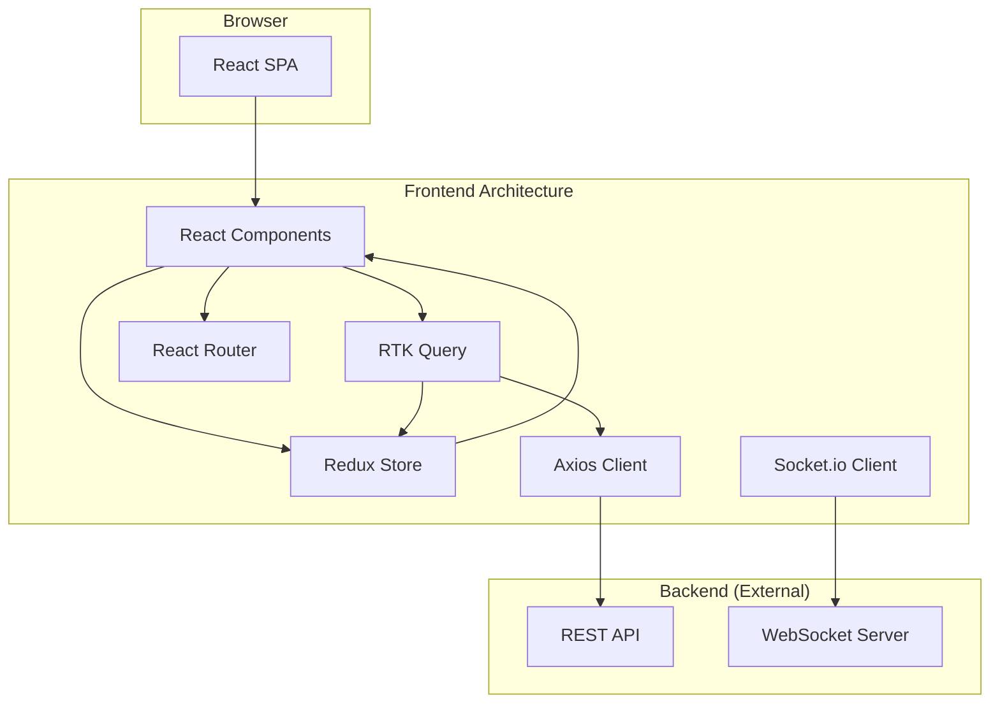

# Trellone Architecture

## System Architecture

Trellone is a client-rendered Single Page Application (SPA) built with React and Vite. It follows a component-based architecture, with a clear separation of concerns between UI components, application state, and API interactions.

- **UI Layer:** Built with React and Material-UI, responsible for rendering the user interface and handling user interactions.
- **State Management:** Centralized state management is handled by Redux Toolkit, including RTK Query for data fetching and caching, and Redux Persist for persisting authentication state.
- **API Layer:** Communicates with a separate backend service via a RESTful API (using Axios) for data retrieval and mutations, and WebSockets (using Socket.IO) for real-time collaboration.
- **Routing:** Handled client-side by React Router, with route-based code splitting using `React.lazy()` and `Suspense`.

## Source Code Paths

- **Core Application Logic:** [`src/App.tsx`](src/App.tsx) (routing, auth), [`src/main.tsx`](src/main.tsx) (entry point), [`src/theme.ts`](src/theme.ts) (styling).
- **UI Components:** Reusable components are in [`src/components/`](src/components/), page-level components are in [`src/pages/`](src/pages/).
- **State Management:** Redux slices are located in [`src/store/slices/`](src/store/slices/), with the root configuration in [`src/store/root.reducer.ts`](src/store/root.reducer.ts).
- **API Communication:** RTK Query API slices are in [`src/queries/`](src/queries/). The Axios and Socket.IO clients are configured in [`src/lib/http.ts`](src/lib/http.ts) and [`src/lib/socket.ts`](src/lib/socket.ts).
- **Validation:** Zod schemas for validating data are located in [`src/schemas/`](src/schemas/).
- **Types:** Shared TypeScript types are in [`src/types/`](src/types/).
- **Utilities:** Helper functions are in [`src/utils/`](src/utils/).
- **Constants:** Application-wide constants are in [`src/constants/`](src/constants/).
- **Custom Hooks:** Reusable hook logic is in [`src/hooks/`](src/hooks/).

## Key Technical Decisions

- **Vite for Build Tooling:** Chosen for its fast development server and optimized production builds.
- **Material-UI for UI Components:** Provides a comprehensive set of well-designed and accessible components.
- **Redux Toolkit with RTK Query:** A modern and efficient way to manage application state and handle data fetching, caching, and real-time updates.
- **React Hook Form with Zod:** For type-safe and performant form handling and validation.
- **Socket.IO for Real-Time:** Enables real-time collaboration features like live updates on boards.
- **TypeScript for Type Safety:** Ensures a more robust and maintainable codebase.

## Design Patterns in Use

- **Component-Based Architecture:** The UI is broken down into reusable and composable React components.
- **Centralized State Management:** A single Redux store serves as the source of truth for the application state.
- **Container/Presentational Pattern:** Page components often act as containers that fetch data and pass it down to presentational components.
- **Custom Hooks:** Reusable logic is extracted into custom hooks to be shared across components (e.g., [`use-debounce.ts`](src/hooks/use-debounce.ts), [`use-query-params.ts`](src/hooks/use-query-params.ts)).
- **Provider Pattern:** Used extensively for providing theme, Redux store, and router context to the application.
- **Module Augmentation:** Used in [`theme.ts`](src/theme.ts) to extend MUI's theme type definitions.

## Critical Implementation Paths

- **Authentication Flow:** The authentication flow is managed through the `auth` slice in Redux, with API calls handled by RTK Query in [`src/queries/auth.ts`](src/queries/auth.ts). The HTTP client in [`src/lib/http.ts`](src/lib/http.ts) intercepts requests to add the auth token.
- **Real-Time Board Updates:** The board view in [`src/pages/Boards/BoardDetails/`](src/pages/Boards/BoardDetails/) uses RTK Query hooks to fetch initial data. When a user makes a change, a mutation is dispatched, and a Socket.IO event is emitted to other clients, which then receive the update and refetch or update their cached data.
- **Drag and Drop:** Implemented using `@dnd-kit` for reordering columns and cards. The logic is primarily located within the `BoardDetails` page.
