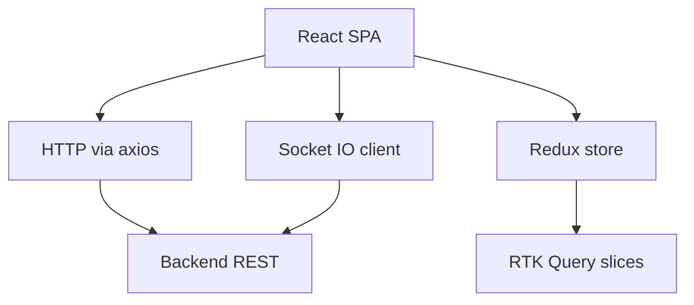
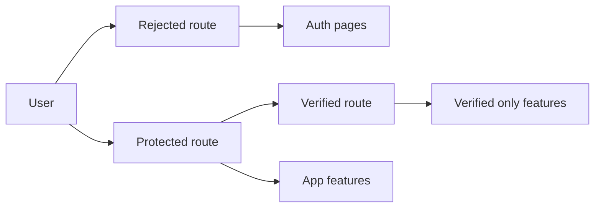
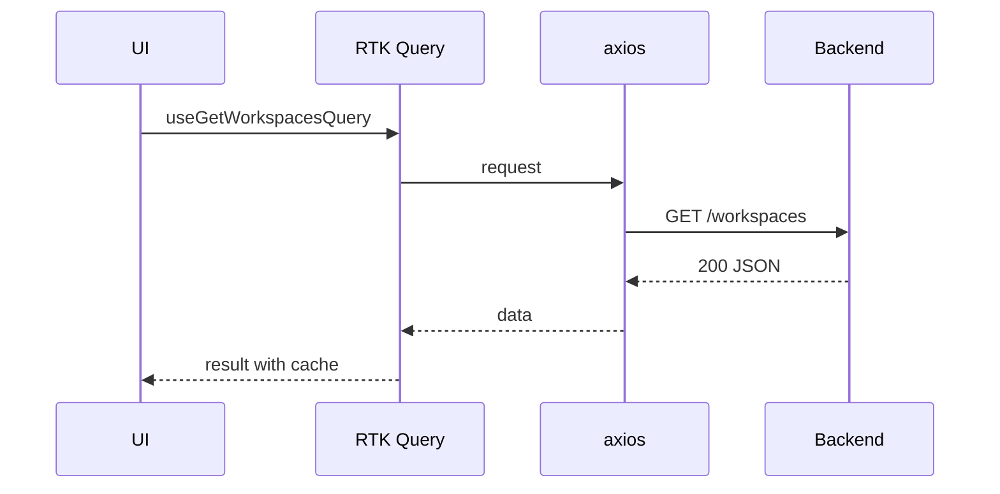
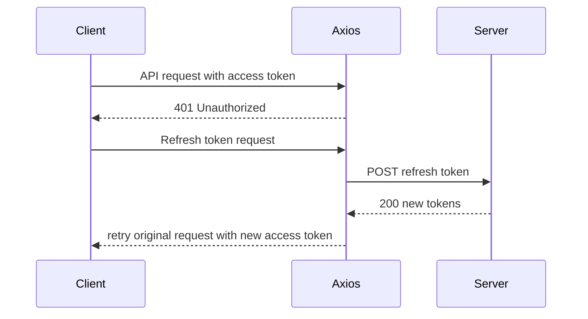
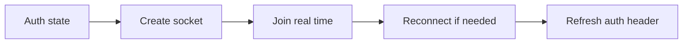

# Architecture Definition: Trellone

## 1. System Architecture

Trellone is a client-side SPA built with React and TypeScript. It consumes a backend API via HTTP and maintains real-time collaboration via Socket.IO. State is centralized with Redux Toolkit and persisted selectively. Data fetching is handled by RTK Query using a custom axios base query.

Key anchors in code:

- Routes, guards, and Suspense boundaries: [export default App](src/App.tsx:230)
- ProtectedRoute and RejectedRoute declarations: [const ProtectedRoute](src/App.tsx:39), [const RejectedRoute](src/App.tsx:43), [const VerifiedRoute](src/App.tsx:59)
- RTK Query axios base query: [axiosBaseQuery()](src/lib/redux/helpers.ts:5)
- HTTP client and token lifecycle: [class Http](src/lib/http.ts:24), [Http.handleRefreshToken](src/lib/http.ts:131)
- Socket factory: [generateSocketInstace()](src/lib/socket.ts:4)
- Store setup and middleware: [configureStore()](src/lib/redux/store.ts:34)
- Theme system: [extendTheme()](src/theme.ts:46)
- Workspace API slice: [workspaceApi = createApi()](src/queries/workspaces.ts:23)

Mermaid: High level topology

## 2. Directory Structure

High value entry points:

- Application
  - [App.tsx](src/App.tsx)
  - [theme.ts](src/theme.ts)
- Infrastructure
  - [lib/http.ts](src/lib/http.ts)
  - [lib/socket.ts](src/lib/socket.ts)
  - [lib/redux/store.ts](src/lib/redux/store.ts)
  - [lib/redux/helpers.ts](src/lib/redux/helpers.ts)
- API slices
  - [queries/workspaces.ts](src/queries/workspaces.ts)
  - [queries/boards.ts](src/queries/boards.ts)
  - [queries/cards.ts](src/queries/cards.ts)
  - [queries/columns.ts](src/queries/columns.ts)
  - [queries/auth.ts](src/queries/auth.ts)
  - [queries/users.ts](src/queries/users.ts)
  - [queries/medias.ts](src/queries/medias.ts)
  - [queries/invitations.ts](src/queries/invitations.ts)
- State slices
  - [store/root.reducer.ts](src/store/root.reducer.ts)
  - [store/slices/app.slice.ts](src/store/slices/app.slice.ts)
  - [store/slices/auth.slice.ts](src/store/slices/auth.slice.ts)
  - [store/slices/board.slice.ts](src/store/slices/board.slice.ts)
  - [store/slices/card.slice.ts](src/store/slices/card.slice.ts)
  - [store/slices/notification.slice.ts](src/store/slices/notification.slice.ts)
  - [store/slices/workspace.slice.ts](src/store/slices/workspace.slice.ts)

## 3. Routing and Guards

- Route configuration and lazy loading: [App.tsx](src/App.tsx)
- Protected areas use [ProtectedRoute](src/App.tsx:39) and [VerifiedRoute](src/App.tsx:59) to enforce auth and verification
- Unauthenticated flows use [RejectedRoute](src/App.tsx:43)
- Suspense fallbacks are provided via [PageLoadingSpinner](src/components/Loading/PageLoadingSpinner/PageLoadingSpinner.tsx:1)

Mermaid: Route access control

## 4. State Management

- Central store with persistence: [configureStore()](src/lib/redux/store.ts:34)
  - Auth slice persisted via [persistReducer](src/lib/redux/store.ts:21)
  - RTK Query middlewares registered from domain API slices: [api middlewares](src/lib/redux/store.ts:23)
- Root reducer composition: [root.reducer.ts](src/store/root.reducer.ts)

Slices of note:

- [auth.slice.ts](src/store/slices/auth.slice.ts)
- [app.slice.ts](src/store/slices/app.slice.ts)
- [board.slice.ts](src/store/slices/board.slice.ts)
- [card.slice.ts](src/store/slices/card.slice.ts)
- [workspace.slice.ts](src/store/slices/workspace.slice.ts)

## 5. Data Access Layer

RTK Query is used with a custom axios base query.

- Base query: [axiosBaseQuery()](src/lib/redux/helpers.ts:5)
- Example API: [workspaceApi = createApi()](src/queries/workspaces.ts:23)
  - Tags: [const tagTypes](src/queries/workspaces.ts:21)
  - Queries: [getWorkspaces](src/queries/workspaces.ts:41), [getWorkspace](src/queries/workspaces.ts:52)
  - Mutations: [addWorkspace](src/queries/workspaces.ts:28), [updateWorkspace](src/queries/workspaces.ts:57), [editWorkspaceMemberRole](src/queries/workspaces.ts:65), [leaveWorkspace](src/queries/workspaces.ts:77), [removeWorkspaceMember](src/queries/workspaces.ts:85), [joinWorkspaceBoard](src/queries/workspaces.ts:140)

Mermaid: RTK Query data lifecycle

## 6. HTTP Client and Auth

- Axios instance with interceptors: [class Http](src/lib/http.ts:24)
  - Attach access token header for requests: [request interceptor](src/lib/http.ts:41)
  - Persist tokens on login and clear on logout: [response interceptor](src/lib/http.ts:59)
  - Auto refresh on expiration: [handleRefreshToken](src/lib/http.ts:131)
  - Unauthorized handling triggers logout via RTK Query: [logout dispatch](src/lib/http.ts:123)

Mermaid: Token refresh flow

## 7. Real-time Collaboration

- Socket is created when user is authenticated: [generateSocketInstace()](src/lib/socket.ts:4)
- Auth header refreshes on reconnect attempts: [reconnect handler](src/lib/socket.ts:19)

Mermaid: Socket lifecycle

## 8. Theming and UI System

- Theme via [extendTheme()](src/theme.ts:46) with colorSchemes for light and dark
- Component overrides: [MuiCssBaseline](src/theme.ts:84), [MuiAppBar](src/theme.ts:101), [MuiButton](src/theme.ts:118), [MuiOutlinedInput](src/theme.ts:139), etc.
- App heights and layout constants in theme.trellone: [trellone config](src/theme.ts:46)

## 9. Error Handling and UX

- Global toasts for non 422 and non 401 errors in response interceptor: [toast integration](src/lib/http.ts:82)
- Unverified account UX: custom toast message: [unverified error branch](src/lib/http.ts:91)
- Button level loading indicator via interceptor loading utility: [interceptorLoadingElements](src/lib/http.ts:16)

## 10. Build and Deployment

- Dev server: npm run dev
- Build: npm run build
- Preview: npm run preview
- Vercel ready with dist output
- Dockerfile provides containerized preview flow

## 11. Security Considerations

- JWT in LocalStorage with careful refresh logic
- Cookies enabled via axios withCredentials
- Sanitization for markdown via rehype-sanitize
- Protected and verified route guards in [App.tsx](src/App.tsx)

## 12. Key Architectural Decisions

- RTK Query for data and cache lifecycle with tag based invalidation
- Axios base query to unify headers, errors, and retries
- Socket auth aligned with LS token to maintain continuity across sessions
- Theme centralization for consistent layout metrics and component styling

## 13. References

- Routes and guards: [App.tsx](src/App.tsx)
- Theme: [theme.ts](src/theme.ts)
- HTTP: [lib/http.ts](src/lib/http.ts)
- Socket: [lib/socket.ts](src/lib/socket.ts)
- Store: [lib/redux/store.ts](src/lib/redux/store.ts)
- Base query: [lib/redux/helpers.ts](src/lib/redux/helpers.ts)
- Workspaces API: [queries/workspaces.ts](src/queries/workspaces.ts)
