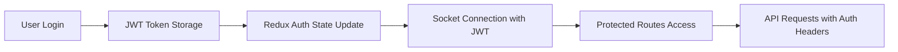
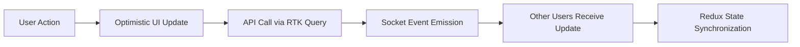
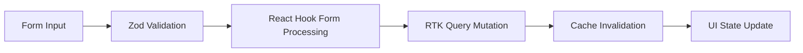

# Architecture Definition: Trellone

## 1. System Architecture

Trellone is a client-side, single-page application (SPA) built with React 18.3.1 and TypeScript 5.7.2. It communicates with a separate backend API for data persistence and real-time collaboration via Socket.io.

```mermaid
graph TD
    A[Client (React SPA)] -->|HTTP/HTTPS (Axios)| B(Backend API)
    A -->|WebSocket (Socket.io)| B
    A -->|Redux Store| C[Local State Management]
    A -->|RTK Query| D[API Cache Layer]
    C -->|Redux Persist| E[LocalStorage]
    A -->|Vite Build| F[Production Bundle]
```

## 2. Directory Structure

The `src` directory follows a feature-based organization with clear separation of concerns between components, pages, services, and state management.

**Core Application Structure:**

- **`/src/App.tsx`**: Main application component with routing, authentication logic, and protected/rejected route handling
- **`/src/main.tsx`**: Application entry point with comprehensive provider setup (Redux, Router, MUI Theme, Error Boundary)
- **`/src/theme.ts`**: Material-UI theme configuration with dark/light mode support and custom styling
- **`/src/index.css`**: Global CSS styles and Material-UI customizations

**Feature-Based Organization:**

- **`/src/assets`**: Static assets organized by feature (auth, 404, front-page, react.svg, trello.svg)
- **`/src/components`**: Reusable UI components organized by functionality

  - **`/src/components/AppBar`**: Main application bar component
  - **`/src/components/Dialog`**: Modal dialog components (NewBoardDialog, NewWorkspaceDialog)
  - **`/src/components/DrawerHeader`**: Drawer header component for navigation
  - **`/src/components/ErrorBoundary`**: Error handling and fallback UI
  - **`/src/components/Favicon`**: Dynamic favicon management component
  - **`/src/components/Form`**: Form-related components (TextFieldInput, ToggleFocusInput, FieldErrorAlert, VisuallyHiddenInput)
  - **`/src/components/Loading`**: Loading indicators and spinners (PageLoadingSpinner)
  - **`/src/components/Main`**: Main content wrapper component
  - **`/src/components/Modal`**: Complex modal components (ActiveCard with attachments, dates, comments, etc.)
  - **`/src/components/NavBar`**: Navigation bar with search, create, profile, notifications, workspaces
  - **`/src/components/SEO`**: SEO component for metadata management with react-helmet-async
  - **`/src/components/TooltipLink`**: Reusable tooltip link component
  - **`/src/components/Workspace`**: Workspace-related UI components (WorkspaceAvatar)

- **`/src/pages`**: Route-specific page components with lazy loading
  - **`/src/pages/Auth`**: Authentication pages (Login, Register, OAuth, ForgotPassword, ResetPassword, AccountVerification, ForgotPasswordVerification)
    - **`/src/pages/Auth/layouts/AuthLayout`**: Authentication page layout wrapper
  - **`/src/pages/Boards`**: Board management and details
    - **`/src/pages/Boards/BoardDetails`**: Main board view with drag-and-drop functionality
    - **`/src/pages/Boards/BoardDetails/components`**: Board-specific components (BoardBar, BoardContent, Card, Column, etc.)
    - **`/src/pages/Boards/BoardInvitationVerification`**: Board invitation handling
  - **`/src/pages/Workspaces`**: Workspace dashboard and board organization
    - **`/src/pages/Workspaces/pages/Home`**: Workspace dashboard with recently viewed boards
    - **`/src/pages/Workspaces/pages/BoardsList`**: List of workspace boards
    - **`/src/pages/Workspaces/pages/WorkspaceBoardsList`**: Workspace-specific board lists
    - **`/src/pages/Workspaces/layouts/HomeLayout`**: Workspace layout with navigation
    - **`/src/pages/Workspaces/components/NavigationMenu`**: Workspace navigation with collapse functionality
  - **`/src/pages/Settings`**: User settings and account management (AccountTab, SecurityTab)
  - **`/src/pages/FrontPage`**: Marketing/landing page with comprehensive components (Hero, Features, Productivity, Workflows, CTA, Footer)
  - **`/src/pages/404`**: Error page with NotFound component

**Technical Infrastructure:**

- **`/src/constants`**: Application-wide constants organized by domain

  - **`/src/constants/config.ts`**: Environment and application configuration
  - **`/src/constants/type.ts`**: Type definitions, enums, and value arrays
  - **`/src/constants/path.ts`**: Route path definitions
  - **`/src/constants/pagination.ts`**: Pagination-related constants
  - **`/src/constants/http-status-code.ts`**: HTTP status code enum
  - **`/src/constants/mock-data.ts`**: Mock data for development/testing
  - **`/src/constants/animations.ts`**: Animation configuration constants with keyframes
  - **`/src/constants/front-page.ts`**: Front page content constants and data
  - **`/src/constants/site.ts`**: Site-wide constants and metadata configuration

- **`/src/hooks`**: Custom React hooks for reusable logic

  - **`/src/hooks/use-debounce.ts`**: Debounce functionality hook
  - **`/src/hooks/use-infinite-scroll.ts`**: Infinite scroll functionality
  - **`/src/hooks/use-query-config.ts`**: Query configuration management
  - **`/src/hooks/use-query-params.ts`**: URL search params handling

- **`/src/lib`**: Third-party library configurations and core utilities

  - **`/src/lib/redux`**: Redux store configuration and helpers
    - **`/src/lib/redux/store.ts`**: Store setup with persistence and middleware
    - **`/src/lib/redux/hooks.ts`**: Typed Redux hooks (useAppDispatch, useAppSelector)
    - **`/src/lib/redux/helpers.ts`**: Custom axios base query for RTK Query
  - **`/src/lib/http.ts`**: Axios HTTP client configuration
  - **`/src/lib/socket.ts`**: Socket.io client configuration with JWT auth
  - **`/src/lib/sensors.ts`**: Drag-and-drop sensor configuration for @dnd-kit
  - **`/src/lib/jwt-decode.ts`**: JWT token decoding utilities

- **`/src/queries`**: RTK Query API definitions organized by entity

  - **`/src/queries/auth.ts`**: Authentication endpoints
  - **`/src/queries/boards.ts`**: Board management endpoints
  - **`/src/queries/cards.ts`**: Card operations endpoints
  - **`/src/queries/columns.ts`**: Column management endpoints
  - **`/src/queries/users.ts`**: User management endpoints
  - **`/src/queries/medias.ts`**: File upload/media handling
  - **`/src/queries/invitations.ts`**: Board invitation system
  - **`/src/queries/workspaces.ts`**: Workspace management endpoints

- **`/src/schemas`**: Zod validation schemas for type safety and form validation

  - **`/src/schemas/auth.schema.ts`**: Authentication-related schemas
  - **`/src/schemas/board.schema.ts`**: Board management schemas
  - **`/src/schemas/card.schema.ts`**: Card operation schemas
  - **`/src/schemas/user.schema.ts`**: User management schemas

- **`/src/store`**: Redux Toolkit store configuration

  - **`/src/store/slices`**: Redux slices for different feature domains
    - **`/src/store/slices/auth.slice.ts`**: User authentication state
    - **`/src/store/slices/app.slice.ts`**: Application-wide state (socket connections)
    - **`/src/store/slices/board.slice.ts`**: Active board state management
    - **`/src/store/slices/card.slice.ts`**: Active card state management
    - **`/src/store/slices/notification.slice.ts`**: Notification system state
    - **`/src/store/slices/workspace.slice.ts`**: Workspace state management
  - **`/src/store/root.reducer.ts`**: Root reducer combining all slices

- **`/src/types`**: TypeScript type definitions organized by domain

  - **`/src/types/jwt.type.ts`**: JWT and authentication-related types
  - **`/src/types/query-params.type.ts`**: URL query parameter interfaces
  - **`/src/types/utils.type.ts`**: General utility types and error handling

- **`/src/utils`**: General utility functions organized by functionality
  - **`/src/utils/utils.ts`**: General utilities (color generation, placeholders, DOM manipulation)
  - **`/src/utils/validators.ts`**: File and data validation functions
  - **`/src/utils/storage.ts`**: Local storage management utilities
  - **`/src/utils/error-handlers.ts`**: Error type checking and handling functions
  - **`/src/utils/oauth.ts`**: OAuth and authentication utilities
  - **`/src/utils/formatters.ts`**: String and data formatting functions
  - **`/src/utils/sorts.ts`**: Array sorting and ordering utilities

## 3. State Management Architecture

**Redux Toolkit 2.6.0 with RTK Query:**

- Centralized store with feature-based slices using Redux Toolkit patterns
- RTK Query for efficient data fetching, caching, and synchronization with automatic cache invalidation
- Redux Persist 6.0.0 for selective state persistence (auth state only)
- Custom axios base query for consistent HTTP handling across all API endpoints

**Key Redux Slices:**

- **`auth.slice.ts`**: User authentication state (isAuthenticated, profile)
- **`app.slice.ts`**: Application-wide state (socket connections, global UI state)
- **`board.slice.ts`**: Active board state management with async thunks for board details
- **`card.slice.ts`**: Active card state management with modal visibility
- **`notification.slice.ts`**: Notification system state and real-time updates
- **`workspace.slice.ts`**: Workspace state management and organization

**RTK Query API Slices:**

- **`authApi`**: Authentication endpoints (login, register, logout, OAuth)
- **`boardApi`**: Board management endpoints (CRUD operations, invitations)
- **`cardApi`**: Card operations endpoints (CRUD, attachments, comments)
- **`columnApi`**: Column management endpoints (CRUD, reordering)
- **`userApi`**: User management endpoints (profile, settings)
- **`mediaApi`**: File upload and media handling endpoints
- **`invitationApi`**: Board invitation system endpoints
- **`workspaceApi`**: Workspace management endpoints

## 4. Real-time Architecture

**Socket.io 4.8.1 Integration:**

- Dynamic socket instance creation with JWT authentication in headers
- Room-based collaboration (users join specific board rooms for isolated updates)
- Real-time events for board updates, card changes, user actions, and presence
- Automatic reconnection handling with connection state management
- Integration with Redux store for state synchronization

**Key Socket Events:**

- **Client Events**:
  - `CLIENT_JOIN_BOARD` - Join specific board room
  - `CLIENT_LEAVE_BOARD` - Leave board room
  - `CLIENT_USER_UPDATED_BOARD` - Broadcast board changes
  - `CLIENT_USER_UPDATED_CARD` - Broadcast card changes
- **Server Events**:
  - `SERVER_BOARD_UPDATED` - Receive board updates from other users
  - `SERVER_CARD_UPDATED` - Receive card updates from other users
  - `SERVER_USER_ACCEPTED_BOARD_INVITATION` - Handle invitation acceptances

## 5. Component Architecture

**Route-Level Components with Lazy Loading:**

- All major page components use React.lazy() for code splitting
- Suspense boundaries with PageLoadingSpinner for loading states
- Protected and rejected route components for authentication-based access control
- SEO optimization with react-helmet-async 2.0.5 for metadata management

**Reusable Component Library:**

- Material-UI 5.16.14 based component system with custom theming
- Consistent styling patterns using sx prop and styled components
- Modular modal and dialog system with complex state management
- Form components with React Hook Form 7.54.2 and Zod 3.24.2 validation

**Key Component Patterns:**

- **Drag-and-Drop**: @dnd-kit 6.3.1 for accessible board, column, and card interactions
- **Forms**: Comprehensive form handling with validation and error display
- **Loading States**: Consistent loading indicators and skeleton screens
- **Error Boundaries**: Graceful error handling with fallback UI components
- **Real-time Updates**: Components that respond to Socket.io events and Redux state changes
- **SEO Management**: Dynamic metadata management with SEO component

## 5.1 Workspace Settings - Visibility Architecture

- UI Components:
  - [`WorkspaceSettings.tsx`](src/pages/Workspaces/pages/WorkspaceSettings/WorkspaceSettings.tsx:46) uses [`Helmet`](src/components/SEO/SEO.tsx) to set page metadata and renders the visibility section and actions
  - [`WorkspaceVisibilityPopover.tsx`](src/pages/Workspaces/pages/WorkspaceSettings/components/WorkspaceVisibilityPopover/WorkspaceVisibilityPopover.tsx:40) provides the Change action with options Private and Public
- Constants and Types:
  - [`WorkspaceType`](src/constants/type.ts:9) defines Public and Private
  - [`WorkspaceVisibilityType`](src/schemas/workspace.schema.ts) aligns with backend schema validation
- Permissions:
  - Visibility controls are gated by [`useWorkspacePermission`](src/hooks/use-permissions.ts) and [`WorkspacePermission.ManageWorkspace`](src/constants/permissions.ts)
- Data Fetching and Mutations:
  - Workspace details fetched via [`useGetWorkspaceQuery()`](src/queries/workspaces.ts:51)
  - Visibility change performed via [`useUpdateWorkspaceMutation()`](src/queries/workspaces.ts:56)
  - Cache invalidation on update: [`invalidatesTags`](src/queries/workspaces.ts:58) refreshes specific Workspace id and LIST to keep details and lists in sync

Summary: Workspace Settings contains pre-defined `updateWorkspace` mutation that is applied to greedy & precise patch input. The default `updateWorkspace` requires only `user-id` and `id` because an optimistic update optimistic update `visibility-provider-bails-if-missing`. Additionally the hook auto-generates an `optimistic-id` if one is not already on the `useUpdateWorkspaceDto` because `visibility-provider-bails-if-missing`. This way the optimistic visibility provider will have enough info to provide optimistic update to other checkout pages - **despite** local cache having thrown away the `Workspace` detail.

Mermaid: Workspace visibility update flow

```mermaid
graph LR
    A[User opens Workspace Settings] --> B[Visibility section rendered]
    B --> C[User clicks Change]
    C --> D[Popover with options Private Public]
    D --> E[User selects next type]
    E --> F[RTK Query mutate updateWorkspace]
    F --> G[Backend updates workspace type]
    G --> H[RTK Query invalidates Workspace id and LIST]
    H --> I[Workspace details refetched and UI updated]
```



## 6. Data Flow Patterns

**Authentication Flow:**



**Real-time Collaboration Flow:**



**Form Submission Flow:**



## 7. Performance Optimizations

- **Code Splitting**: Route-based lazy loading with React.lazy() and Suspense
- **Bundle Analysis**: rollup-plugin-visualizer 5.14.0 for bundle size monitoring
- **Memoization**: Strategic use of React.memo, useMemo, and useCallback
- **Efficient Re-renders**: Optimized Redux selectors and component structure
- **Asset Optimization**: Vite 6.1.0 automatic asset optimization and compression
- **Dead Code Elimination**: Automatic dead code elimination in production builds
- **SVG Optimization**: vite-plugin-svgr 4.3.0 for optimized SVG imports

## 8. Security Patterns

- **JWT Authentication**: Secure token-based authentication with refresh token support
- **Route Protection**: ProtectedRoute and RejectedRoute components for access control
- **Input Validation**: Comprehensive Zod schemas for all form inputs and API data
- **XSS Prevention**: rehype-sanitize 6.0.0 for safe markdown rendering
- **HTTPS Enforcement**: Production deployment requires HTTPS for security
- **Environment Variables**: Secure configuration management with Vite environment handling

## 9. Build and Deployment Architecture

- **Build Tool**: Vite 6.1.0 for fast development and optimized production builds
- **TypeScript Compilation**: Strict mode TypeScript 5.7.2 with comprehensive type checking
- **Environment Configuration**: Environment-based configuration with development and production settings
- **Static Asset Handling**: Optimized asset processing and caching strategies
- **SEO Optimization**: react-helmet-async for metadata management and search engine optimization
- **Deployment**: Vercel-ready configuration with automatic deployments and environment variable management

## 10. Development Workflow

- **Hot Module Replacement**: Vite dev server with instant updates during development
- **Code Quality**: ESLint 9.19.0 and Prettier 3.5.2 integration with pre-commit hooks
- **Type Safety**: 100% TypeScript coverage with strict mode and comprehensive type definitions
- **Error Handling**: Comprehensive error boundaries and development-time error reporting
- **Development Scripts**: Comprehensive npm scripts for development, building, linting, and formatting

## 11. SEO and Marketing Features

- **Dynamic SEO**: Comprehensive SEO component with Open Graph and Twitter meta tags
- **Landing Page**: Complete front page with hero section, features, productivity tabs, workflows
- **Site Configuration**: Centralized site metadata and configuration management
- **Social Media Integration**: Open Graph images and social sharing optimization
- **Animation System**: Custom keyframe animations for enhanced user experience Phase 4: Database Integration (with a football-themed approach)

while states.finished < len(players):
player_to_play = None # For bots, prioritize those with the furthest marker, then players with second_to_play condition
for i, player_info in enumerate(players):
if player_info.bot_type and arena.markers[player_info.name] > states.progress.get(player_info.name, 0):
if player_to_play is None or arena.markers[player_info.name] > arena.markers[states.current_player_name]:
player_to_play = player_info.name
for i, player_info in enumerate(players):
if not player_info.bot_type and states.second_to_play == player_info.name:
player_to_play = player_info.name
break # If no such players, pick any second_to_play player, or if all are bots, play normally
if player_to_play is None:
for i, player_info in enumerate(players):
if states.second_to_play == player_info.name:
player_to_play = player_info.name
break
if player_to_play is None:
player_to_play = states.current_player_name

    # Get yards to play
    yards_to_play = 1
    if not arena.possession_changes[states.current_player_name] and not arena.unimpeded_progress[states.current_player_name] and not states.progression.aborted:
        yards_to_play = await get_yards_to_play(
            states.progress.get(states.current_player_name, 0), player_to_play, states,
            progressive_play=not states.progression.aborted or states.progression.is_progressive,
            is_end(states.progress.get(states.current_player_name, 0), states.progress.get(states.current_player_name, 0) + yards_to_play)
        )

    # Randomly determine yardage gain
    actual_yards = yards_to_play * min(1, (1 - states.progression.stiffened_penalty)) * (1 - states.progression.fail_penalty)
    states.progress[states.current_player_name] = min(10, states.progress.get(states.current_player_name, 0) + actual_yards)

    # Update states
    states.second_to_play = states.current_player_name
    states.finished += 1
    states.possession_changes_this_play = 0
    values.progress = states.progress
    values.seconds_to_play = states.seconds_to_play
    values.possession_changes_this_play = states.possession_changes_this_play
    values.possession_changes = states.possession_changes
    values.second_to_play = states.second_to_play
    values.finished = states.finished

    # Simulate one second being used
    time.sleep(1)
    states.seconds_to_play -= 1
    values.seconds_to_play = states.seconds_to_play

    # End condition: all players have at least 1 yard progress, or after a reasonable length of time (9.5 seconds)
    if all(states.progress.values()) or states.seconds_to_play < 0.5:
        player = None
        # Assign first player as the winner to avoid any issues with multiple winning combinations
        player_info = players[0]
        for i, p in enumerate(players):
            if get_player_score(states, i) == min_score:
                player_info = p
        return ArenaState(
            tags=states.tags,
            round=states.round,
            stats=states.stats,
            finished=True,
            marker_progress=states.progress,
            attempt_stats=states.attempt_stats,
            difficulty_stats={k: Dict[str, float](
                avg=(v[0] if v[0] is not None else 0),
                mins=(states.round - 1) or 1,
                sum=int(v[1] * max(0, min(states.round - 1, 1))) if v[1] is not None else 0,
                min=int(v[2] or (v[0] if v[0] is not None else 0) or 0),
                max=int(v[3] or (v[0] if v[0] is not None else 0) or 10)
            ) for k, v in difficulty_stats.items()},
            improvement_stats={
                # only modify here if there are >1 opponent
                'max': {'min': 1.0 if len(states.progress) <= 2 else 0.75, 'max': 1.5},
                'prev_session': {'min': 1.0 if len(states.progress) <= 2 else 0.75, 'max': 1.5},
                'ptp': {'min': 1.0 if len(states.progress) <= 2 else 0.75, 'max': 1.5}
            }
        )

def create_marking_state(
before_width=0.1,
during_width=0.1,
after_width=0.1,
first_color='yellow',

    second_color='yellow',
    third_color='yellow',
    lose_color='yellow',
    glow_color='yellow',
    marker_color='white',
    border_color='white',
    border_size=4,
    glow_adjust=0

):
return MarkingBoardState(
before_width=before_width,
during_width=during_width,
after_width=after_width,
lines_width=0.5,
lines_color='white',
markers_font_size=20,
markers_font_thickness=4,
markers_font_color=marker_color,
markers_location_x=0.5,
markers_location_y=0.5,
first_color=first_color,
second_color=second_color,
third_color=third_color,
lose_color=lose_color,
glow_color=glow_color,
background_color='black',
border_color=border_color,
border_size=border_size,
glow_adjust=glow_adjust
)

def apply_theme(state: ArenaState, image):
"""Transform: (img) -> img
Apply a black & white filter with Mesa WB optimized for
Abstract Academic Photoshop Effects. Transforms available for each Round.
Takes the base starting image and returns the final completed image.
All processing must be performed using only Python libraries.
"""

    try:
        import cv2
        import numpy as np
    except:
        log_with_context('Failed to import cv2/numpy: Could not process image.')
        return image

    gray = cv2.cvtColor(image, cv2.COLOR_BGR2GRAY)
    _, thresh = cv2.threshold(gray, 20, 255, cv2.THRESH_BINARY)

    return thresh
