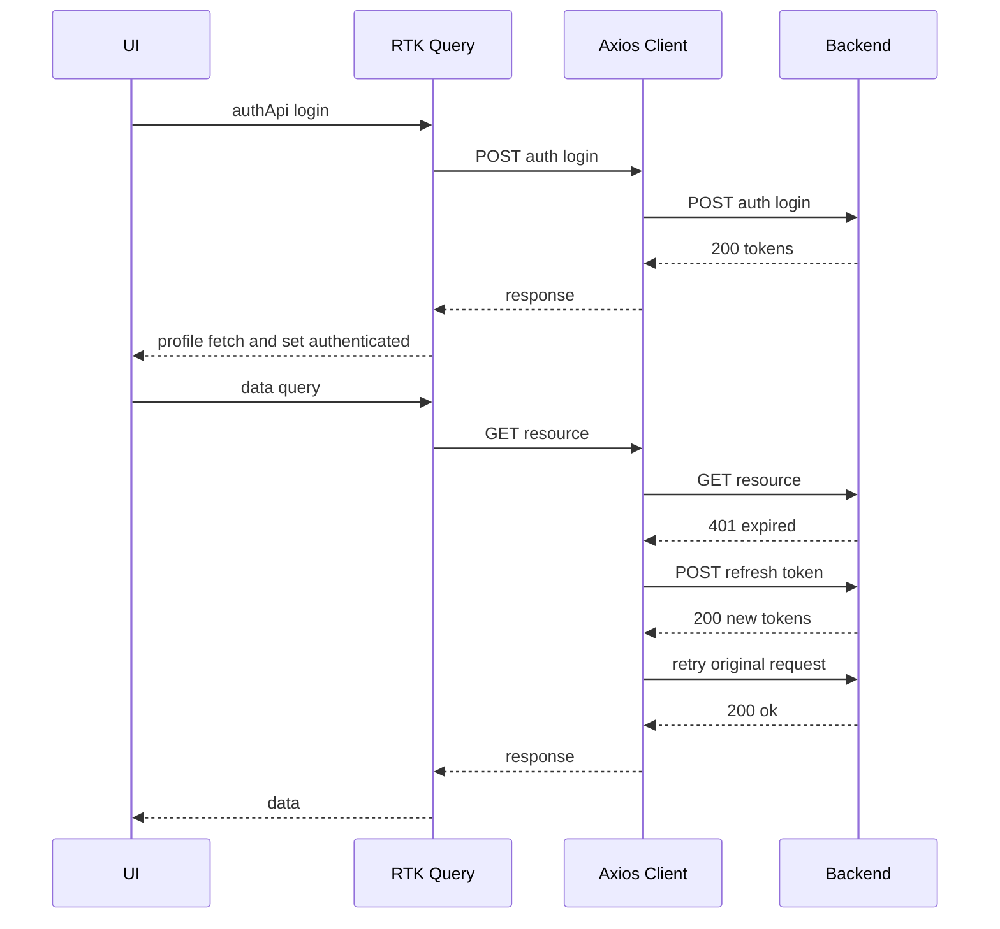
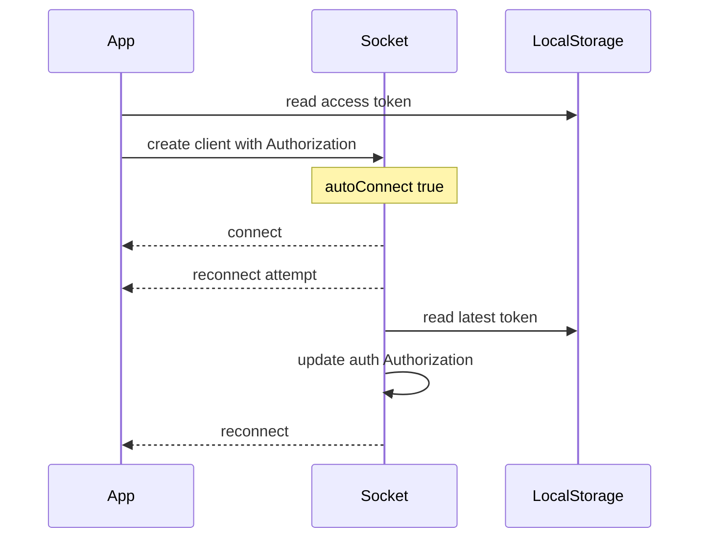

# Architecture Overview

Trellone is a React 18 + TypeScript single page application structured by feature, with state management via Redux Toolkit and data fetching via RTK Query over a centralized Axios client. Real time collaboration uses Socket.IO with JWT auth. The UI is built with Material-UI and a custom CSS Vars theme.

## Source code layout and key paths

- Application bootstrap and providers

  - [src/main.tsx](src/main.tsx) entry point and provider composition
  - [src/App.tsx](src/App.tsx) routing and route guards
  - [src/theme.ts](src/theme.ts) Material-UI theme with app-specific tokens

- State, store and RTK Query

  - [src/lib/redux/store.ts](src/lib/redux/store.ts) store configuration and redux-persist
  - [src/store/root.reducer.ts](src/store/root.reducer.ts) slices and API reducers composition
  - Slices: [src/store/slices](src/store/slices)
  - API slices: [src/queries](src/queries)

- HTTP client and API base

  - [src/lib/http.ts](src/lib/http.ts) Axios instance, interceptors and token lifecycle
  - [src/lib/redux/helpers.ts](src/lib/redux/helpers.ts) axiosBaseQuery for RTK Query

- Real-time

  - [src/lib/socket.ts](src/lib/socket.ts) Socket.IO client factory and reconnect auth refresh

- Routing

  - [src/constants/path.ts](src/constants/path.ts) route constant definitions
  - Page modules: [src/pages](src/pages)

- Utilities, hooks, constants, schemas
  - [src/utils](src/utils) utilities including storage, error handlers, formatters, validators
  - [src/hooks](src/hooks) custom hooks
  - [src/constants](src/constants) config, enums, site metadata
  - [src/schemas](src/schemas) Zod schemas and derived types

## Application bootstrap

Providers in render tree (outer to inner) are composed in [src/main.tsx](src/main.tsx):

- Redux Provider with persisted store (redux-persist)
- React Router BrowserRouter
- HelmetProvider for SEO
- MUI CssVarsProvider with custom theme from [src/theme.ts](src/theme.ts)
- material-ui-confirm ConfirmProvider with sensible defaults
- GlobalStyles and CssBaseline
- ErrorBoundary wrapper
- MUI LocalizationProvider (date-fns with enGB)
- App component and ToastContainer

Store injection

- [src/lib/http.ts](src/lib/http.ts) exposes injectStore to allow Axios interceptors to dispatch Redux actions from outside React components
- Injected once at app start in [src/main.tsx](src/main.tsx)

## Routing and route guards

- Route constants in [src/constants/path.ts](src/constants/path.ts)
- Routes and guards in [src/App.tsx](src/App.tsx)
  - ProtectedRoute: requires authenticated user and profile to access app routes
  - RejectedRoute: blocks authenticated users from accessing auth pages, with exceptions for verification flows
  - VerifiedRoute: requires profile.verify to be 1 for sensitive routes like board details; shows toast and redirects to account settings if not verified
- Code splitting via React.lazy and Suspense with a loading spinner

## State management

Store configuration

- [src/lib/redux/store.ts](src/lib/redux/store.ts)
  - redux-persist with localStorage, whitelist only the auth slice for persistence
  - DevTools enabled in non-production
  - Middleware: default middleware extended with all RTK Query middlewares

Root reducer composition

- [src/store/root.reducer.ts](src/store/root.reducer.ts)
  - Feature slices: app, auth, board, card, notification, workspace
  - API reducers: authApi, userApi, workspaceApi, boardApi, columnApi, cardApi, mediaApi, invitationApi

Slices overview (high level)

- app slice: holds application-wide state such as Socket.IO instance
- auth slice: isAuthenticated and profile, used by route guards and auth flows
- board, card, workspace, notification slices: feature states for UI responsiveness and optimistic behavior

Typed hooks for components

- [src/lib/redux/hooks.ts](src/lib/redux/hooks.ts) provides useAppDispatch and useAppSelector

## API layer and HTTP client

Axios instance with interceptors

- [src/lib/http.ts](src/lib/http.ts)
  - Base URL from envConfig.baseUrl, JSON headers, withCredentials enabled
  - Request interceptor:
    - Adds Authorization header from in-memory token or localStorage
    - Toggles a shared UI loading flag via interceptorLoadingElements
  - Response interceptor:
    - On login: stores access and refresh tokens in memory and localStorage
    - On logout: clears tokens and localStorage
    - Error handling:
      - Toasts errors except 422 and 401; shows a custom message for unverified users
      - On 401 expired token: runs a deduplicated refresh-token flow and retries the original request with new token
      - On refresh failure or 401 not due to expiry: clears storage and dispatches authApi.logout

RTK Query baseQuery

- [src/lib/redux/helpers.ts](src/lib/redux/helpers.ts) exposes axiosBaseQuery() which wraps the Axios instance and maps responses and errors to RTK Query’s shape
- All API slices use this baseQuery

API slices and responsibilities (representative)

- [src/queries/auth.ts](src/queries/auth.ts): auth endpoints (login, logout, register, verify, forgot, reset); coordinates profile fetch and store updates on success; global cache reset on logout
- [src/queries/users.ts](src/queries/users.ts): user profile CRUD; updates auth slice profile on success
- [src/queries/workspaces.ts](src/queries/workspaces.ts), [src/queries/boards.ts](src/queries/boards.ts), [src/queries/columns.ts](src/queries/columns.ts), [src/queries/cards.ts](src/queries/cards.ts), [src/queries/invitations.ts](src/queries/invitations.ts), [src/queries/medias.ts](src/queries/medias.ts): feature domain endpoints with tags for caching and invalidation
- Cache tags and invalidation patterns are consistently used for list and item targets

## Real-time architecture

Socket.IO client factory

- [src/lib/socket.ts](src/lib/socket.ts) generates a Socket.IO client with Authorization Bearer token via the auth option
- On reconnect_attempt, socket.auth is refreshed from the latest localStorage token to match new auth state after token refresh

Socket lifecycle in app

- After successful authentication with a profile, [src/App.tsx](src/App.tsx) dispatches setSocket(generateSocketInstace(accessToken))
- app slice stores the socket instance for use across features
- Feature pages join or leave rooms as needed and may rejoin on connection events

## Theming and UI system

MUI CSS Vars theme

- [src/theme.ts](src/theme.ts) extends theme with trellone-specific tokens for layout sizing (nav heights, drawer widths, board metrics)
- Light and dark palettes with text colors tuned for readability
- Component styleOverrides for AppBar, Link, Button, InputLabel, Typography, OutlinedInput, ListItemButton, ListItemIcon
- Global scrollbar styling via CssBaseline overrides
- Theme applied with CssVarsProvider in [src/main.tsx](src/main.tsx)

## Critical flows

Authentication and token lifecycle

- Login:
  - User submits credentials via authApi login; Axios response interceptor stores access and refresh tokens in memory and localStorage
  - Post-login, the app fetches the user profile and marks isAuthenticated true in the auth slice
- Token refresh:
  - On 401 expired token, Axios refreshes tokens via refresh-token endpoint with a deduped promise, then retries the failed request with the new token
- Logout:
  - Any auth failure or explicit logout triggers clearing localStorage and dispatching authApi.logout
  - [src/App.tsx](src/App.tsx) listens to LocalStorageEventTarget clearLS to reset auth state and disconnect the socket

Socket lifecycle

- On authentication success, socket is created and stored in app slice
- On reconnect attempts, socket updates the Authorization value from latest localStorage
- Feature pages rejoin their rooms on reconnect where applicable

Routing guards

- ProtectedRoute ensures private sections are only accessible to authenticated users with a loaded profile
- RejectedRoute blocks authenticated users from accessing auth pages except for verification routes
- VerifiedRoute restricts sensitive sections to users with verified accounts and shows a toast prompting verification otherwise

## Build and environment

- Vite-based build with React SWC plugin and SVGR; SPA routing deployable on static hosts and Vercel
- Env variables prefixed with VITE\_ configure API URLs and OAuth parameters; see [src/constants/config.ts](src/constants/config.ts)

## Sequence diagrams

Auth and token refresh sequence

Socket lifecycle sequence

## Design principles and patterns

- Feature-first directory organization for clear boundaries
- Redux Toolkit for slices and RTK Query for data fetching and caching
- Single Axios client with standardized interceptors and a baseQuery wrapper
- Real-time collaboration layered on top of authenticated Socket.IO
- MUI with sx prop and a centralized theme for consistent design tokens and overrides
- Persist only essential auth state to minimize rehydration and serialization issues

## Risks and considerations

- Token storage in localStorage is convenient but requires careful handling to avoid stale auth; refresh flow and reconnect auth update mitigate this
- Socket reconnection timing on background tabs is addressed with reconnection settings; consider websocket-only transport if infra supports it
- Ensure route guards and verified checks remain in sync with server-side authorization policies
