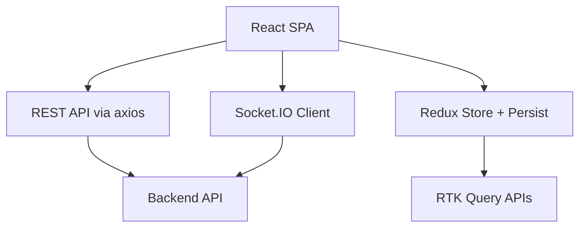

# Trellone Project Brief

## Project Overview

Trellone is a modern Trello-like project management SPA built with React and TypeScript. It provides boards, columns, and cards with real-time collaboration, advanced workspace management, and a polished Material‑UI interface. The app is bundled with Vite and integrates Redux Toolkit with RTK Query for state and data fetching.

Key implementation anchors:

- Routing, auth guards, and lazy loading in [src/App.tsx](src/App.tsx)
- Theme system in [src/theme.ts](src/theme.ts) using [extendTheme()](src/theme.ts:46)
- HTTP client with token lifecycle in [src/lib/http.ts](src/lib/http.ts) via [class Http](src/lib/http.ts:24)
- Socket.IO client factory in [generateSocketInstace()](src/lib/socket.ts:4)
- Redux store, persistence, and RTK Query middlewares in [configureStore()](src/lib/redux/store.ts:34)
- Workspace RTK Query slice in [workspaceApi = createApi()](src/queries/workspaces.ts:23)

## Core Value Proposition

- Real-time collaboration using Socket.IO with resilient reconnection and auth refresh
- Intuitive, responsive UI using Material‑UI with dark/light color schemes
- End-to-end board workflow: create workspaces, boards, columns, and cards with drag-and-drop
- Rich content: markdown descriptions, attachments, due dates, reactions
- Production-ready build pipeline with Vite, type safety, and linted codebase

## Target Users

- Development teams planning sprints and tasks
- Project managers coordinating cross-functional work
- SMBs and startups needing a self-hostable Trello-like workflow
- Remote teams collaborating in real time

## Success Metrics

- Engagement: active boards, real-time session counts, presence metrics
- Performance: responsive navigation and sub-second UI updates
- Reliability: reconnection success rate, low error to toast ratio
- UX quality: smooth drag-and-drop, accessible color contrast, consistent themeing
- Code quality: passing lint/type checks, maintainable TypeScript coverage

## Technical Boundaries

- Frontend-only SPA; backend API is separate and accessed via REST and WebSocket
- Modern browser requirements with WebSocket support
- Environment variables must be prefixed with VITE\_ to be exposed to client
- Tokens are stored in LocalStorage with refresh handled by the HTTP client

## Project Scope

In scope:

- Full CRUD workflow for workspaces, boards, columns, and cards
- Real-time updates and collaboration across users
- Rich card features: markdown, attachments, due dates, comments, reactions
- Role/permission checks in UI flows and workspace membership management
- Theming and responsive UI with Material‑UI

Out of scope:

- Backend service implementation
- Native mobile apps
- Enterprise SSO and advanced analytics
- Deep third-party calendar/task integrations

## Success Criteria

- Feature completeness of core Trello-like flows
- Stable real-time sync with optimistic UX and low error rates
- Clean, maintainable TypeScript with strict mode
- Production-grade builds and configurable environments

## Technical Foundation

- React 18.3.1, React Router 6.29.0
- TypeScript ~5.7.2
- Material‑UI 5.16.14
- Redux Toolkit 2.6.0 with RTK Query, React‑Redux 9.2.0, Redux Persist 6.0.0
- Socket.IO client 4.8.1
- React Hook Form 7.54.2 with Zod 3.24.2 and @hookform/resolvers 3.10.0
- Axios 1.8.3, Lodash 4.17.21, date‑fns 2.30.0
- Vite 6.1.0, @vitejs/plugin-react-swc 3.5.0, vite-plugin-svgr 4.3.0

## Reference Files

- App routes, guards, Suspense: [src/App.tsx](src/App.tsx) and [export default App](src/App.tsx:230)
- Theme system: [src/theme.ts](src/theme.ts)
- HTTP client: [src/lib/http.ts](src/lib/http.ts)
- Socket.IO client: [src/lib/socket.ts](src/lib/socket.ts)
- Redux store: [src/lib/redux/store.ts](src/lib/redux/store.ts)
- Workspace API: [src/queries/workspaces.ts](src/queries/workspaces.ts)

## Mermaid: High-level Architecture

