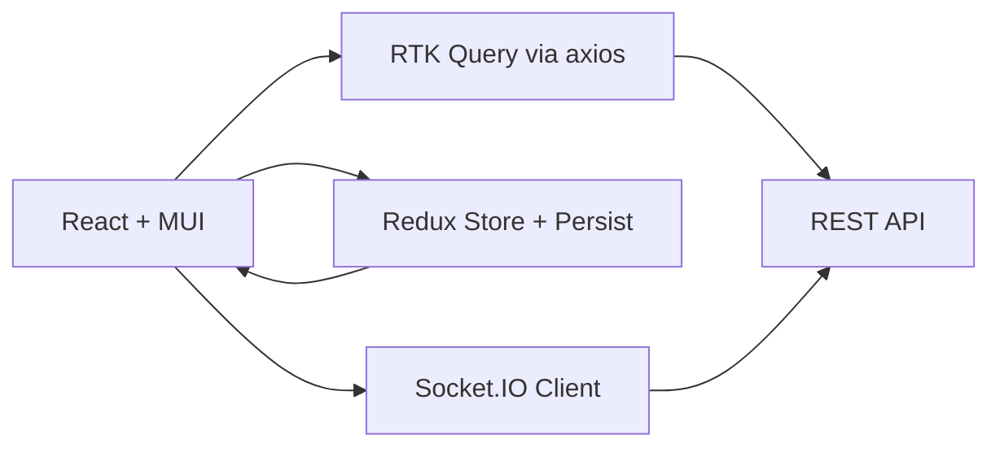

# Project Context

## Current Status

The project is in a mature, production-ready state. Trellone is a fully functional Trello-like SPA with real-time collaboration.

## Implementation Status

### Core Features - Complete

- Authentication system with JWT and Google OAuth
- Board, column, and card management with drag-and-drop
- Real-time updates via Socket.IO
- Rich content on cards: markdown, attachments, due dates, covers, comments and reactions
- Advanced UI/UX with Material-UI themes and responsive design
- Workspace management with members/guests and settings

### Technical Infrastructure - Complete

- Redux Toolkit 2.6.0 with RTK Query and cache invalidation
- TypeScript 5.7.2 strict mode across the codebase
- React Hook Form 7.54.2 + Zod 3.24.2 validation
- Vite 6.1.0 build with code splitting and lazy loading
- ESLint 9.19.0 and Prettier 3.5.2 integration

### Production Features - Complete

- SEO via react-helmet-async 2.0.5
- Error boundaries and graceful error handling
- Vercel-ready deployment with environment variables
- Input sanitization (rehype-sanitize) and XSS prevention
- Bundle analysis via rollup-plugin-visualizer

## Recent Development Activity (as of September 2025)

- Route structure, protected/rejected routes, and lazy loading confirmed in [src/App.tsx](src/App.tsx)
- Workspace API slice with tags and cache invalidation in [src/queries/workspaces.ts](src/queries/workspaces.ts)
- Axios client with token refresh and interceptors in [src/lib/http.ts](src/lib/http.ts)
- Socket factory with reconnection strategies in [src/lib/socket.ts](src/lib/socket.ts)
- Redux store with persisted auth and RTK Query middlewares in [src/lib/redux/store.ts](src/lib/redux/store.ts)
- MUI theme with colorSchemes and component overrides in [src/theme.ts](src/theme.ts)

## Current Focus

Maintenance and enhancements:

- Code quality and TypeScript strictness
- Performance tuning and bundle hygiene
- Workspace features, permissions, and visibility management
- Documentation and developer experience

## Technical Stack Snapshot

- React 18.3.1, React Router 6.29.0
- TypeScript ~5.7.2
- Material-UI 5.16.14 (+ icons, lab, x-date-pickers 6.9.2)
- Redux Toolkit 2.6.0, React-Redux 9.2.0, Redux Persist 6.0.0
- RTK Query with custom axios base query
- Socket.IO client 4.8.1
- React Hook Form 7.54.2, Zod 3.24.2, @hookform/resolvers 3.10.0
- Axios 1.8.3, Lodash 4.17.21, date-fns 2.30.0
- react-toastify 11.0.5, emoji-picker-react 4.12.3, @uiw/react-md-editor 4.0.5
- Vite 6.1.0, @vitejs/plugin-react-swc 3.5.0, vite-plugin-svgr 4.3.0

## Environments and Scripts

- Dev: npm run dev
- Build: npm run build
- Preview: npm run preview
- Lint/Format: npm run lint, npm run lint:fix, npm run prettier, npm run prettier:fix

## Architecture Highlights

- SPA with route-based code splitting and Suspense fallbacks
- Centralized Redux store with persisted auth; RTK Query APIs per domain
- HTTP via axios with token refresh and LS-backed auth headers
- Socket.IO instance tied to auth state, with reconnect auth refresh
- MUI theme configured via experimental_extendTheme with light/dark color schemes

## Active Files and References

- [src/App.tsx](src/App.tsx)
- [src/queries/workspaces.ts](src/queries/workspaces.ts)
- [src/lib/http.ts](src/lib/http.ts)
- [src/lib/socket.ts](src/lib/socket.ts)
- [src/lib/redux/store.ts](src/lib/redux/store.ts)
- [src/theme.ts](src/theme.ts)

## Next Steps

- Add memory bank files: brief.md, product.md, architecture.md, tech.md
- Keep context.md updated after notable changes, especially dependency upgrades and feature flags

## Mermaid: High-level Data Flow

