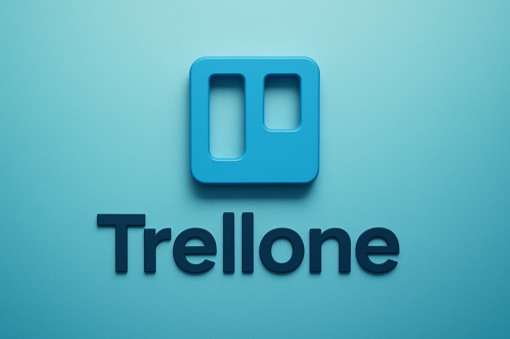

# Trellone App (Frontend) 🚀

<p align="center">
  
</p>

Trellone is a Kanban-style project management app inspired by Trello. This repository is the frontend only, built with React + Material UI and talking to a separate backend API.

### Key Features ✨

- ✅ Smooth drag-and-drop boards, lists, and cards (dnd-kit)
- 🧭 Workspaces, members/guests, invitations, access control
- 🔐 Email/password auth, account verification, JWT, Google OAuth
- ⚡ Real-time updates via Socket.IO
- 📝 Rich text editor, 😀 reactions, 📎 attachments, ⏰ due dates, 📅 date pickers
- 🎨 Polished UI with MUI, light/dark modes, and toast notifications

### Tech Stack 🧰

- **React 18**: Component-based UI library for building fast, interactive UIs.
- **React Router 6**: Client-side routing with code-splitting and nested routes.
- **TypeScript**: Static typing for safer, more maintainable code.
- **Vite 6**: Lightning-fast dev server and build tool.
- **Material UI (MUI) v5**: Component library with theming and accessibility baked in.
- **Emotion**: CSS-in-JS engine powering MUI styling.
- **Redux Toolkit + Redux Persist**: Predictable state management with persistence.
- **RTK Query-style callers (via Axios)**: Typed API calls and caching patterns.
- **dnd-kit**: Modern, accessible drag-and-drop utilities.
- **react-hook-form + zod**: Performant forms with schema validation.
- **axios**: Promise-based HTTP client with interceptors.
- **date-fns**: Lightweight date utilities.
- **socket.io-client**: Real-time bi-directional communication.
- **react-toastify**: Beautiful toast notifications.

## Getting Started 🏁

### Requirements 🧪

- Node.js 18+ (20+ recommended)
- npm (or your preferred package manager)

### Installation 📦

```bash
npm install
```

Create a `.env` at the project root:

```env
# API URL
VITE_APP_API_URL='http://localhost:8000'

# Frontend App URL (optional, for canonical / og:url in SEO)
# If omitted, it falls back to `window.location.origin`.
VITE_APP_URL='http://localhost:3000'

# Google OAuth
VITE_GOOGLE_CLIENT_ID='your-google-client-id'
VITE_GOOGLE_REDIRECT_URI='http://localhost:8000/auth/oauth/google'

# Preview Mode (optional for Vite preview on VPS)
VITE_PREVIEW_ALLOWED_HOSTS='yourdomain.com,sub.yourdomain.com'
```

### Run in Development 🧑‍💻

```bash
npm run dev
```

The app runs at `http://localhost:3000` (see `vite.config.ts`).

### Useful Scripts 🛠️

```bash
npm run dev       # start dev server
npm run build     # production build
npm run preview   # preview the built app
npm run lint      # lint check
npm run lint:fix  # auto-fix lint issues where possible
```

## Google OAuth Setup (Quick) 🔑

1. Create a Google Cloud project → APIs & Services.
2. Configure OAuth consent screen (External/Internal) with basic info.
3. Create OAuth Client ID (Application type: Web application).
4. Settings:
   - Authorized JavaScript origins: `http://localhost:8000`
   - Authorized redirect URIs: `http://localhost:8000/auth/oauth/google`
5. Put values into `.env`:
   - `VITE_GOOGLE_CLIENT_ID`
   - `VITE_GOOGLE_REDIRECT_URI` (point to `/login/oauth` on your domain)

See [SETUP_GOOGLE_OAUTH.md](src/docs/SETUP_GOOGLE_OAUTH.md) for detailed, Trellone-specific notes.

## Project Structure (Simplified) 🗂️

```
📦trellone-app
 ┣ 📂src
 ┃ ┣ 📂assets                                # Static assets: images, SVGs, logos
 ┃ ┣ 📂components                            # Reusable UI components (Material-UI, `sx`-styled)
 ┃ ┣ 📂constants                             # Static config, API/base paths, app-level constants
 ┃ ┣ 📂docs                                  # Developer docs, onboarding, integration guides
 ┃ ┣ 📂hooks                                 # Custom React hooks (typed, project-specific)
 ┃ ┣ 📂lib                                   # Library configs, third-party adapters (e.g., RTK Query, MUI theme)
 ┃ ┣ 📂pages                                 # Page-level components mapped to routes (Auth, Boards, Workspaces, ...)
 ┃ ┣ 📂queries                               # API query/mutation logic (RTK Query endpoints and hooks)
 ┃ ┣ 📂schemas                               # Zod schemas, schema types (validation, API contract)
 ┃ ┣ 📂store                                 # Redux Toolkit slices and root store setup
 ┃ ┣ 📂types                                 # Global and feature-specific type definitions
 ┃ ┣ 📂utils                                 # Generic utility functions and helpers
 ┃ ┣ 📜App.tsx                               # Root application component (routing, providers)
 ┃ ┣ 📜index.css                             # Global CSS, resets, font imports
 ┃ ┣ 📜main.tsx                              # SPA entry point (React root, hydration)
 ┃ ┣ 📜theme.ts                              # Material-UI theme definition (design tokens, palettes, overrides)
 ┃ ┣ 📜vite-env.d.ts                         # TypeScript type declarations for Vite environment variables
```

## Deploy 🚢

Options:

- Deploy frontend to Vercel for speed.
- Or use the provided Dockerfile:

```bash
docker build -t trellone-app .
docker run -p 3000:3000 trellone-app
```

Note: This is frontend-only. You must run a backend API and point env URLs accordingly.

### Backend Repository 🔗

- Trellone API (Node/Express, TypeScript): [https://github.com/Congglee/trellone-server](https://github.com/Congglee/trellone-server)

## Troubleshooting 🧯

- Blank page after Google login: verify `VITE_GOOGLE_REDIRECT_URI` matches your Google Console redirect URI exactly.
- 401/CORS: check `VITE_APP_*_API_URL` and backend CORS settings.
- Vite preview blocked on VPS: add your domain(s) to `VITE_PREVIEW_ALLOWED_HOSTS`.

## Contributing 🤝

PRs are welcome! Open an issue for bugs or feature proposals.

## License 📜

Open source, free to use — no restrictions.
